<!-- GENERATED FROM pipeline-machine.json — DO NOT EDIT -->
# Executable pipeline map

```mermaid
flowchart LR
    Pm1["-1 · methodology"]
    P0["0 · researcher"]
    P1["1 · grill-with-docs"]
    P2["2 · planning-with-files"]
    P2mPM["2-PM · pm-review"]
    P2b["2b · grace-init, grace-plan"]
    P3["3 · design-first"]
    P4["4 · contract"]
    P4b["4b · judge contract"]
    P4c["4c · visualization"]
    P5["5 · to-issues"]
    P5d5["5.5 · scaffold"]
    P6["6 · build-loop, tdd"]
    P7["7 · judge feature, code-review-expert"]
    Pm1 --> P0
    P0 --> P1
    P1 --> P2
    P2 --> P2mPM
    P2mPM --> P2b
    P2b --> P3
    P3 --> P4
    P4 --> P4b
    P4b --> P4c
    P4c --> P5
    P5 --> P5d5
    P5d5 --> P6
    P6 --> P7
```

| Phase | Skill | Tiers | Semantic inputs | Human gate |
|---|---|---|---|---|
| -1 | `methodology` | T3, T4 | — | `—` |
| 0 | `researcher` | T2, T3, T4 | `product_brief.md` `evidence-handoff.json/decision` delivery | `—` |
| 1 | `grill-with-docs` | T2, T3, T4 | `product_brief.md` `evidence-handoff.json/decision` delivery | `—` |
| 2 | `planning-with-files` | T2, T3, T4 | `product_brief.md` `evidence-handoff.json/validation_stage` ['alpha', 'live'] | `—` |
| 2-PM | `pm-review` | T3, T4 | `task_plan.md` `product_brief.md` | `—` |
| 2b | `grace-init, grace-plan` | T3, T4 | `task_plan.md` `pm-review.json/status` APPROVE | `—` |
| 3 | `design-first` | T3, T4 | `task_plan.md` `pm-review.json/status` APPROVE | `—` |
| 4 | `contract` | T2, T3, T4 | `task_plan.md` `evidence-handoff.json/decision` delivery `pm-review.json/status` APPROVE `docs/knowledge-graph.xml` `risk-review.json/verdict` PASS | `—` |
| 4b | `judge contract` | T2, T3, T4 | `contract.json` | `—` |
| 4c | `visualization` | T2, T3, T4 | `contract.json` `judge-report.json/data/verdict` PASS | `—` |
| 5 | `to-issues` | T2, T3, T4 | `contract.json` `task_plan.md` `judge-report.json/data/verdict` PASS | `viz_before_tickets` |
| 5.5 | `scaffold` | T3, T4 | `contract.json` `task_plan.md` `issues-manifest.json/status` approved `docs/knowledge-graph.xml` | `—` |
| 6 | `build-loop, tdd` | T2, T3, T4 | `contract.json` `scaffold-manifest.json/status` ready | `contract_locked` |
| 7 | `judge feature, code-review-expert` | T0, T1, T2, T3, T4 | `build-evidence.json/status` complete `rollout-plan.json/rollback/defined` True | `human_acceptance` |

Risk policy: T0=mechanical · T1=bounded_bugfix · T2=small_reversible_feature · T3=cross_module_or_high_risk · T4=safety_regulatory_irreversible
