<!-- GENERATED FROM pipeline-machine.json — DO NOT EDIT -->
# Executable pipeline map

```mermaid
flowchart LR
    Pm1["-1 · discovery process"]
    P0["0 · researcher"]
    P1["1 · grill-with-docs"]
    P2["2 · planning-with-files"]
    P2mPM["2-PM · pm-review"]
    P2b["2b · grace-init, grace-plan"]
    P3["3 · design-rubric, design-first"]
    P3r["3r · risk-review"]
    P4["4 · contract"]
    P4b["4b · judge contract"]
    P4c["4c · visualization"]
    P5["5 · to-issues"]
    P5d5["5.5 · scaffold"]
    P6f["6f · targeted change or diagnose+tdd"]
    P6["6 · build-loop, tdd"]
    P7["7 · judge feature, code-review-expert"]
    Pm1 -->|T3 conditional, T4 conditional| P0
    Pm1 -->|T3, T3 conditional, T4, T4 conditional| P1
    P0 -->|T2 conditional, T3 conditional, T4 conditional| P1
    P1 -->|T2, T2 conditional, T3, T3 conditional, T4, T4 conditional| P2
    P2 -->|T3, T3 conditional, T4, T4 conditional| P2mPM
    P2 -->|T2 conditional| P3
    P2 -->|T2, T2 conditional| P4
    P2mPM -->|T3, T3 conditional, T4, T4 conditional| P2b
    P2b -->|T3 conditional, T4 conditional| P3
    P2b -->|T4, T4 conditional| P3r
    P2b -->|T3, T3 conditional| P4
    P3 -->|T4 conditional| P3r
    P3 -->|T2 conditional, T3 conditional| P4
    P3r -->|T4, T4 conditional| P4
    P4 -->|T2, T2 conditional, T3, T3 conditional, T4, T4 conditional| P4b
    P4b -->|T2, T2 conditional, T3, T3 conditional, T4, T4 conditional| P4c
    P4c -->|T2, T2 conditional, T3, T3 conditional, T4, T4 conditional| P5
    P5 -->|T3, T3 conditional, T4, T4 conditional| P5d5
    P5 -->|T2, T2 conditional| P6
    P5d5 -->|T3, T3 conditional, T4, T4 conditional| P6
    P6f -->|T0, T1| P7
    P6 -->|T2, T2 conditional, T3, T3 conditional, T4, T4 conditional| P7
    P2mPM -. APPROVE (next) .-> P2b
    P2mPM -. REVISE (return) .-> P2
    P3r -. PASS (next) .-> P4
    P3r -. REVISE (return) .-> P2
    P3r -. STOP (stop) .-> STOP["stop"]
    P4b -. PASS (next) .-> P4c
    P4b -. CONDITIONAL (return) .-> P4
    P4b -. FAIL (return) .-> P4
    P6 -. PASS (next) .-> P7
    P6 -. CONTRACT_GAP (return) .-> P4
    P6 -. SCAFFOLD_DRIFT (return) .-> P5d5
    P6 -. RESTART (return) .-> P5
    P6 -. SPLIT_REQUIRED (return) .-> P5
    P7 -. PASS (stop) .-> STOP["stop"]
    P7 -. CONDITIONAL (return) .-> P6
    P7 -. FAIL (return) .-> P6
```

| Phase | Skill | Tiers | Run when | Entry inputs | Entry gate | Completion |
|---|---|---|---|---|---|---|
| -1 | `discovery process` | all before classification; T3, T4 after | universal pre-route intake; required after classification for T3, T4 | — | `—` | — |
| 0 | `researcher` | T2, T3, T4 | `research_required=true` | `product_brief.md` `evidence-handoff.json/decision` ['alpha', 'delivery'] | `—` | — |
| 1 | `grill-with-docs` | T2, T3, T4 | always on selected tier | `product_brief.md` `evidence-handoff.json/decision` delivery `business_model.md` `docs/research-state.json`  when research_required=true | `—` | — |
| 2 | `planning-with-files` | T2, T3, T4 | always on selected tier | `product_brief.md` `evidence-handoff.json/validation_stage` ['alpha', 'live'] `CONTEXT.md` | `—` | — |
| 2-PM | `pm-review` | T3, T4 | always on selected tier | `task_plan.md` `product_brief.md` | `—` | — |
| 2b | `grace-init, grace-plan` | T3, T4 | always on selected tier | `task_plan.md` `pm-review.json/status` APPROVE | `—` | — |
| 3 | `design-rubric, design-first` | T2, T3, T4 | `frontend=true` | `task_plan.md` `pm-review.json/status` APPROVE on T3/T4 | `—` | — |
| 3r | `risk-review` | T4 | always on selected tier | `task_plan.md` `pm-review.json/status` APPROVE `docs/knowledge-graph.xml` | `—` | — |
| 4 | `contract` | T2, T3, T4 | always on selected tier | `task_plan.md` `evidence-handoff.json/decision` delivery `pm-review.json/status` APPROVE on T3/T4 `docs/requirements.xml`  on T3/T4 `docs/technology.xml`  on T3/T4 `docs/development-plan.xml`  on T3/T4 `docs/verification-plan.xml`  on T3/T4 `docs/knowledge-graph.xml`  on T3/T4 `docs/operational-packets.xml`  on T3/T4 `design-contract.json`  when frontend=true `.design-contract-attestation`  when frontend=true `api-contract.json`  when frontend=true `docs/wireframe-*.md`  when frontend=true `risk-review.json/verdict` PASS on T4 `rollout-plan.json/status` ['ready', 'complete'] on T4 `rollout-plan.json/rollback/defined` True on T4 | `—` | — |
| 4b | `judge contract` | T2, T3, T4 | always on selected tier | `contract.json` | `—` | — |
| 4c | `visualization` | T2, T3, T4 | always on selected tier | `contract.json` `judge-report.json/data/verdict` PASS `docs/stories/index.json` | `—` | — |
| 5 | `to-issues` | T2, T3, T4 | always on selected tier | `contract.json` `task_plan.md` `judge-report.json/data/verdict` PASS `SUPERVISION.md` | `viz_before_tickets` | — |
| 5.5 | `scaffold` | T3, T4 | always on selected tier | `contract.json` `task_plan.md` `issues-manifest.json/status` approved `docs/knowledge-graph.xml` | `—` | — |
| 6f | `targeted change or diagnose+tdd` | T0, T1 | always on selected tier | — | `—` | — |
| 6 | `build-loop, tdd` | T2, T3, T4 | always on selected tier | `contract.json` `issues-manifest.json/status` approved `scaffold-manifest.json/status` ready on T3/T4 `iteration-contract.json/status` ready | `contract_locked` | — |
| 7 | `judge feature, code-review-expert` | T0, T1, T2, T3, T4 | always on selected tier | `iteration-budget.json/verdict` PASS on T2/T3/T4 `scaffold-integrity.json/verdict` ['PASS', 'SCAFFOLD_DRIFT'] on T2/T3/T4 `iteration-review.json/acceptor/verdict` PASS on T2/T3/T4 `iteration-dashboard.json/status` PASS on T2/T3/T4 `build-evidence.json/status` complete `rollout-plan.json/status` ['ready', 'complete'] on T4 `rollout-plan.json/rollback/defined` True on T4 | `—` | `code-review.md` `feature-judge-report.json/data/verdict` PASS on T2/T3/T4 gate `human_acceptance` |

Risk policy: T0=mechanical · T1=bounded_bugfix · T2=small_reversible_feature · T3=cross_module_or_high_risk · T4=safety_regulatory_irreversible
Conditional phases: T2 phase 0: research_required=true — only when material factual gaps remain · T2 phase 3: frontend=true — only when the change includes frontend behavior · T3 phase 0: research_required=true — only when material factual gaps remain · T3 phase 3: frontend=true — only when the change includes frontend behavior · T4 phase 0: research_required=true — only when material factual gaps remain · T4 phase 3: frontend=true — only when the change includes frontend behavior
