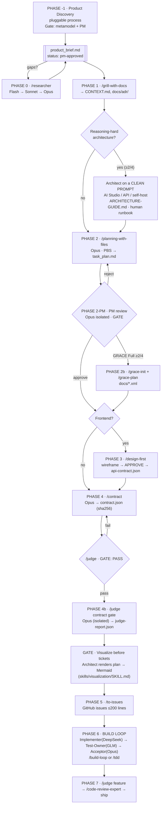

# Pipeline v2 — от ценностного предложения до релиза

Единый сквозной процесс. Sources of truth:
- Process — этот файл
- Prompt format + PCAM — `../agent/PROMPT-FORMAT.md`
- Architect-phase surface (clean prompt) — `ARCHITECTURE-GUIDE.md`
- Cross-model compat — `../agent/COMPAT.md`
- GRACE markup — `templates/project/docs/knowledge-graph.xml`

**Три обязательных правила:**
1. **GRACE Lite mandatory** — MODULE_CONTRACT во всех файлах
2. **product_brief.md** — стартовый артефакт pipeline; заполняется в Phase -1 (или вручную)
3. **Collegium** — reviewer и implementer ДОЛЖНЫ быть разными моделями

---

## Когерентный флоу (9 фаз)

> **Human-legible version** (renders in Obsidian + agent web-chats). The ASCII below is the terminal fallback — keep both in sync.



```
┌─────────────────────────────────────────────────────────────┐
│  PHASE -1: PRODUCT DISCOVERY [pluggable]                     │
│  Mode: 👤 human interview + 🤖 agent research + 👤 PM gate      │
│  Fill product_brief.md using your discovery process          │
│  Gate: metamodel distortion check + PM review                │
│  Output: product_brief.md (status: pm-approved)              │
│         + business_model.md (optional, business info)        │
│  PM approval required before entering Phase 0                │
└─────────────────────────────────────────────────────────────┘
          │
          ▼
┌─────────────────────────────────────────────────────────────┐
│  INPUT: product_brief.md (+ business_model.md, if produced)  │
│  ↓ metamodel distortion check on product_brief.md gaps        │
└─────────────────────────────────────────────────────────────┘
          │
          ▼  [gaps in product_brief.md?]
┌──────────────────────────────────┐
│  PHASE 0: /researcher            │
│  Mode: AGENT                     │
│  Model:  Workers=Flash,          │
│          Synth=Sonnet,           │
│          Orch=Opus               │
│  Output: docs/research-state.json     │
│  → fill gaps in product_brief.md │
└──────────────────────────────────┘
          │
          ▼
┌──────────────────────────────────┐
│  PHASE 1: /grill-with-docs       │
│  Mode: AGENT + human interactive │
│  Model:  Opus/Sonnet             │
│  Input:  product_brief.md        │
│  Output: CONTEXT.md, domain.md,  │
│          docs/adr/               │
└──────────────────────────────────┘
          │
          ▼
┌──────────────────────────────────┐
│  PHASE 2: /planning-with-files   │
│  Mode: AGENT                     │
│  Model:  Opus (PBS decomposition)│
│  Input:  product_brief.md        │
│  Output: task_plan.md, tasks ≤200│
│          lines each              │
│  ┌────────────────────────────┐  │
│  │ Architecture-first order:  │  │
│  │ 1. Layers (depth)          │  │
│  │ 2. Modules (width)         │  │
│  │ 3. Scenarios (SDD)         │  │
│  │ Each layer: RFC round       │  │
│  └────────────────────────────┘  │
│  Reasoning-hard? Architect on a  │
│  clean prompt first —            │
│  ARCHITECTURE-GUIDE.md           │
└──────────────────────────────────┘
          │
          ▼  [PM VALIDATION — GATE]
┌──────────────────────────────────┐
│  PHASE 2-PM: /pm-review          │
│  Mode: AGENT gate, human reviews │
│  Skill: pm-review (PM gate)      │
│  Model: Opus (isolated context,  │
│         ≠ implementer model)     │
│  Input: task_plan.md +           │
│         product_brief.md         │
│  Check:                          │
│  · Arch layers trace to user     │
│    journey (product_brief §7)    │
│  · Each layer → success criterion│
│    (product_brief §8)            │
│  · Edge cases have tasks         │
│  · ≥3 arch options scored before │
│    selecting (superposition)     │
│  Output: pm-review.json          │
│  GATE: APPROVE required          │
└──────────────────────────────────┘
          │ GATE: PM APPROVE
          ▼  [GRACE Full? ≥2/4 criteria]
┌──────────────────────────────────┐
│  PHASE 2b: /grace-init           │
│  Mode: AGENT                     │
│  + /grace-plan                   │
│  Output: docs/knowledge-graph.xml│
│          docs/development-plan.xml│
│          docs/verification-plan.xml│
└──────────────────────────────────┘
          │
          ▼  [Frontend?]
┌──────────────────────────────────┐
│  PHASE 3: /design-first          │
│  Mode: AGENT + HUMAN gate        │
│  Model:  Sonnet (wireframes),    │
│          Opus (gate approval)    │
│  Output: wireframe → APPROVE     │
│          → api-contract.json     │
└──────────────────────────────────┘
          │
          ▼
┌──────────────────────────────────┐
│  PHASE 4: /contract              │
│  Mode: AGENT                     │
│  Model:  Opus                    │
│  Inherits: product_brief.md + api-contract.json│
│  Output: contract.json (sha256)  │
│  → /judge → GATE (PASS required) │
└──────────────────────────────────┘
          │ GATE: judge PASS
          ▼
┌──────────────────────────────────┐
│  PHASE 5: /to-issues             │
│  Mode: AGENT (viz gate)          │
│  Output: GitHub issues           │
│  Each issue = PBS leaf task      │
│  Size: ≤200 lines implementation │
└──────────────────────────────────┘
          │
          ▼
┌──────────────────────────────────────────────────────────────┐
│  PHASE 6: BUILD LOOP (per task, per wave)                    │
│  Mode: AGENT (contract_locked gate before)                   │
│                                                              │
│  [IMPLEMENTER: DeepSeek V4 / GLM 5.2]                       │
│    ↓ reads task + contract.json + GRACE anchors              │
│    ↓ PLAN_CONFIRM before coding                              │
│    ↓ writes code with GRACE Lite markup                      │
│    ↓ writes handoff.json                                     │
│                                                              │
│  [TEST-OWNER: GLM 5.2] ← DIFFERENT MODEL than implementer   │
│    ↓ reads handoff.json + code                               │
│    ↓ writes/runs tests                                       │
│    ↓ AGREE/DISAGREE verdict on implementation                │
│                                                              │
│  [ACCEPTOR: Opus]                                            │
│    ↓ reads test results + handoff                            │
│    ↓ accept → next task OR reject → implementer loop         │
│                                                              │
│  /build-loop (autonomous) OR /tdd (human-paced)             │
└──────────────────────────────────────────────────────────────┘
          │
          ▼
┌──────────────────────────────────┐
│  PHASE 7: /judge feature         │
│  Mode: AGENT gate, human accepts │
│  Model:  Opus (isolated context) │
│  → /code-review-expert           │
│  → ship                          │
└──────────────────────────────────┘

State files at each transition:
  [methodology/*_state.json + situational_assessment.md] (private) → business_model.md + product_brief.md (Phase -1)
  product_brief.md → docs/research-state.json → CONTEXT.md
  → task_plan.md → pm-review.json → contract.json → handoff.json → judge-report.json
```

---

## PBS — Purpose Breakdown Structure

Декомпозировать цели от корня до листьев. Каждый лист = одна задача ≤200 строк / ≤2000 токенов.

```
GOAL_ROOT (из product_brief.md §1 — creator's intent)
  ├── GOAL_1: Архитектурный слой (depth)
  │   ├── PBS_LEAF_1a: auth layer scaffold (≤200 lines, DeepSeek V4)
  │   └── PBS_LEAF_1b: auth tests (≤150 lines, GLM)
  └── GOAL_2: UI слой (width)
      ├── PBS_LEAF_2a: login form component (≤180 lines, GLM)
      └── PBS_LEAF_2b: form tests (≤100 lines, GLM)
```

**Почему ≤200 строк?** SFT = "вырванные страницы из книги". Модель связывает страницы через goal alignment, не через позицию в файле. Большие задачи вызывают strategic blindness (атрибуция пропадает после ~800 строк). Маленькие листья + явная цель = надёжный результат.

**Порядок декомпозиции:**
1. Архитектурные слои (depth) — defines coupling/cohesion
2. Модули по объёму (width) — defines complexity bounds
3. Сценарии/SDD (leaf) — actual implementation

RFC-раунд между слоями: Opus генерирует RFC → GLM/Sonnet review → human approval.

---

## Ветки решений

### Branch 0 — Research нужен?

| Условие | Действие |
|---------|----------|
| product_brief.md заполнен (status: pm-approved) | Пропустить `/researcher` |
| product_brief.md есть, но есть gaps | `/researcher` → заполнить gaps (market/technical/user mode) |
| product_brief.md не заполнен | Запустить Phase -1: свой discovery-процесс или заполнить вручную |
| Только багфикс | Короткий путь: `/triage → /diagnose → /tdd → commit` |

> **Encapsulation**: Phase -1 подключаемая — конвейер не знает, каким discovery-процессом
> заполнен бриф. В фазах 0–7 не появляется терминология того процесса, что его породил.
> `business_model.md` может нести вокабуляр своего discovery-процесса; архитектор переводит его
> в доменные термины проекта при входе в Phase 1. `product_brief.md` — вообще без жаргона.

### Branch A — GRACE Full или Lite?

**GRACE Lite** (обязателен везде, без исключений):
- MODULE_CONTRACT в каждом файле
- START_BLOCK/END_BLOCK для логических блоков
- Логи привязаны к блокам

**GRACE Full** (если ≥ 2 из 4 критериев):

| Критерий | True когда |
|----------|-----------|
| Модулей ≥5 с кросс-ссылками | Сложная feature surface |
| Multi-session | Переживёт `/clear` и `/compact` |
| Long-context | LLM читает 50k+ токенов |
| Multi-agent | Несколько агентов редактируют одни файлы |

GRACE Full добавляет: `docs/knowledge-graph.xml`, `docs/development-plan.xml`, `docs/verification-plan.xml`.

### Branch B — Frontend?

| Решение | Действие |
|---------|----------|
| NO | Пропустить `/design-first`, `is_frontend=false` в contract |
| YES, первая UI-фича | `/design-first` → wireframe → одобрение → api-contract → `/design-rubric` |
| YES, design-contract.json есть | `/contract` inherits автоматически |

**Порядок для frontend:**
1. `/design-first` → wireframe → человеческое одобрение (HARD STOP)
2. API проектируется из wireframe (выход: `api-contract.json`)
3. `/design-rubric` (если впервые) → `design-contract.json`
4. `/contract` → inherits оба контракта

### Branch C — autonomous или human-paced?

| Решение | Skill | Когда |
|---------|-------|-------|
| Autonomous | `/build-loop` | Greenfield, полный contract, Playwright MCP |
| Human-paced | `/tdd` v2 | Backend, сложная логика |
| Bugfix | `/tdd` без contract | Issue = spec |

### Branch D — Architecture reasoning surface (Phase 2 / 2b)

Где рассуждать об архитектуре: внутри агента или на чистом промпте. Полный human runbook + copy-paste промпт: `ARCHITECTURE-GUIDE.md`.

| Условие | Действие |
|---------|----------|
| CRUD / знакомый стек, очевидные слои, ≤4 модуля | Внутри агента — `/planning-with-files` inline |
| Novel domain, высокая связность, ≥5 взаимозависимых модулей, foundational-решение (трудно откатить) | Architect-фаза на **чистом промпте** (AI Studio / API / self-host), затем re-enter |
| Багфикс / мелкая фича | Внутри агента |

**Если ≥2 условий из строки 2** → вынести Architect-фазу из харнеса:
1. Heavy model + bare system prompt + chat (не agent) — `ARCHITECTURE-GUIDE.md §Rule 1–2`
2. Прогнать runbook: system prompt → PLAN_CONFIRM → SYNTHESIS_GATE → GRACE-артефакты
3. Acceptance checklist → сохранить `task_plan.md` / `docs/*.xml` в репо
4. Re-enter: PHASE 2-PM gate (другая модель) + `/judge` plan — гейты не двигаются

> Почему: харнес-промпт агента пресидит generic Belief State в самом высоко-вниманием слоте (`../agent/PROMPT-FORMAT.md` L5). Для reasoning-hard архитектуры это налог — выносим на промпт, где вы владеете каждым токеном.

---

## Collegium Protocol

**Проблема**: кодер и ревьюер из одной модели договариваются не замечать ошибки. Без судьи коллегия плохо выбирает.

**Требование**: каждая роль — РАЗНАЯ модель.

```
IMPLEMENTER (DeepSeek V4)
    ↓ code + handoff.json
TEST-OWNER (GLM 5.2) ← обязательно другая модель
    ↓ AGREE/DISAGREE verdict
ACCEPTOR / JUDGE (Opus, isolated context)
    ↓ final verdict
```

Если TEST-OWNER соглашается с IMPLEMENTER автоматически — это красный флаг. Хорошая коллегия = обнаруженные разногласия, объяснённые в handoff.

Полная командная конфигурация: `agents/team.md`.

---

## GRACE Lite — обязательные правила

Применяются **ко всем проектам без исключений**.

### 1. MODULE_CONTRACT в каждом файле

```
// FILE: path/to/file.ext
// START_MODULE_CONTRACT
//   PURPOSE: [Что делает модуль — одно предложение]
//   SCOPE: [Что включено]
//   DEPENDS: [Зависимости]
//   BLOCK_LIMIT: 200 lines / 2000 tokens
// END_MODULE_CONTRACT
```

### 2. Функциональные контракты

```
// START_CONTRACT: functionName
//   PURPOSE: [Что делает]
//   INPUTS: { param: Type }
//   OUTPUTS: { ReturnType }
//   SIDE_EFFECTS: [или "none"]
// END_CONTRACT: functionName
```

### 3. Логические блоки

```
// START_BLOCK_VALIDATE_INPUT
...
// END_BLOCK_VALIDATE_INPUT
```

### 4. Логи привязаны к блокам

```
logger.info("[Module][function][BLOCK_NAME] message", { correlationId });
```

### 5. Блок-лимит

Каждый MODULE_CONTRACT block ≤2000 токенов. Большие модули → разбить на под-блоки через START_BLOCK/END_BLOCK. Это же ограничение применяется к PBS_LEAF задачам.

---

## State-First Principle

Все скиллы: читают state → производят следующий state → сохраняют в файл.

```
Agent reads current state → produces next state → saves to file
```

LLM мыслит переходами состояний (Belief State в residual stream), а не событийными потоками. State-файлы — это якоря Belief State между хода агентов.

**Верификация = чтение state dump**, не трейс кода.

Цепочка state-файлов:
```
[discovery-process internal state]     — private, Phase -1 only
business_model.md                      — business info for the architect (optional, Phase -1)
product_brief.md                       — pipeline entry (pm-approved)
  → docs/research-state.json (после /researcher, если gaps)
  → CONTEXT.md (после /grill-with-docs)
  → task_plan.md (после /planning-with-files)
  → pm-review.json (после Phase 2-PM — GATE)
  → contract.json (после /contract)
  → handoff.json (после каждого BUILD шага)
  → judge-report.json (после /judge)
```

---

## State ledger & preflight

The state-file chain above is *what* each skill produces. The **ledger** (`.pipeline-state.json`,
one per project, created from `templates/project/.pipeline-state.json`) is *where the pipeline
resumes from* — the single fixed point a new session reads before doing anything. Every skill:
reads the ledger → validates its inputs against it → does its work → writes `artifacts{}` /
`gates_passed` / `phase` back to it. A session that starts with no memory of prior work reads
this file first.

**`scripts/pipeline-preflight.sh <phase> [project_dir]`** runs before each phase and HALTs
(non-zero exit) if any of these aren't satisfied:
1. **Models available** — the phase's `required_model` (and, for collegium phases, each role)
   is listed in the ledger's `models_available` (a declared env manifest — no live probing).
2. **Inputs present & attested** — the phase's `requires` artifacts exist, and if the ledger
   recorded a `sha256` for one, it still matches (it hasn't silently drifted since attestation).
3. **Human gate signed** — if the phase has a `human_gate` (e.g. `viz_before_tickets`,
   `contract_locked`), `ledger.human_gates.<gate>.by` is set.

This generalises `/build-loop`'s 9-check hard gate to the whole pipeline, and closes the gap
where a cycle could start and stall on a missing model. `human_gates.creator_interview` and
`human_gates.discovery_signoff` (the discovery process's creator interview and research
sign-off) are enforced *inside* the discovery skill, not by
preflight — the manual-brief path skips discovery entirely, so preflight can't assume it ran.
They're still recorded in the ledger for audit and cross-session resume.

---

## Structured Output Format

Все агентские скиллы возвращают JSON:

```json
{
  "status": "success | error | needs_info | needs_approval",
  "goal_achieved": true,
  "data": {},
  "confidence": 0.0,
  "hypotheses": [
    { "id": "h1", "description": "...", "score": 0.0, "evidence": [] }
  ],
  "selected_hypothesis": "h1",
  "handoff": {
    "done": [],
    "files_touched": [],
    "uncertain_about": [],
    "test_status": "pass|fail|not_run",
    "next_agent": ""
  },
  "issues": [],
  "trace": [],
  "next_action": ""
}
```

**Superposition principle**: перед коллапсом агент явно перечисляет ≥3 гипотезы, оценивает, выбирает. Обязательно для: research outputs, architecture decisions, design decisions, judge verdicts.

---

## LLM-as-Judge (`/judge`)

Изолированный evaluator — другая модель или отдельный контекст (не связан с generator).

Запускать:
- После `product_brief.md` → тип `product-brief`
- После `/contract` → тип `contract`
- После `/planning-with-files` → тип `plan`
- После завершения фичи → тип `feature`

Подробная рубрика: `skills/judge/SKILL.md`.

---

## Фазы × Skills × Models

| Фаза | Mode | Skill | Model | Артефакты |
|------|------|-------|-------|-----------|
| -1. Discovery | 👤 human interview + 🤖 agent research + 👤 human gate | your discovery process (pluggable) | Opus/Sonnet | `product_brief.md`, `business_model.md` (optional) |
| 0. Research | 🤖 agent | `/researcher` | Flash→Sonnet→Opus | `research-state.json` |
| 1. Discovery | 🤖 agent + 👤 interactive | `/grill-with-docs` | Opus/Sonnet | `CONTEXT.md`, `docs/adr/` |
| 2. Planning | 🤖 agent | `/planning-with-files` | Opus (PBS) | `task_plan.md` |
| 2-PM. PM gate | 🤖 agent gate, isolated — 👤 reviews verdict | `/pm-review` | Opus (isolated) | `pm-review.json` |
| 2b. GRACE Full | 🤖 agent | `/grace-init`, `/grace-plan` | Opus | `docs/*.xml` |
| 3. Design | 🤖 agent + 👤 HUMAN approval gate | `/design-first` | Sonnet + Opus gate | `api-contract.json` |
| 4. Contract | 🤖 agent | `/contract` | Opus | `contract.json` |
| 4b. Judge gate | 🤖 agent gate, isolated | `/judge` | Opus (isolated) | `judge-report.json` |
| 4c. Viz gate | 🤖 renders, 👤 HUMAN gate (viz_before_tickets) | Architect (plan→Mermaid) | Opus | plan diagram `.md` (skills/visualization/SKILL.md) |
| 5. Issues | 🤖 agent | `/to-issues` | Sonnet | GitHub issues |
| 6. Build | 🤖 agent (👤 contract_locked gate before start) | `/tdd` / `/build-loop` | DeepSeek V4 + GLM | commits + `handoff.json` |
| 7. Verify + Review | 🤖 agent gate, isolated — 👤 final acceptance | `/judge feature` → `/code-review-expert` → ship | Opus (isolated) + Sonnet/Opus | `judge-report.json`, review report |

> **Phase 2 / 2b surface** — for reasoning-hard architecture, run the Architect phase on a **bare, self-authored system prompt** (AI Studio / provider API / self-host), not inside the agent harness — the harness system prompt pre-seats a generic Belief State at the highest-attention slot (`../agent/PROMPT-FORMAT.md` L5). Re-enter at the PM gate with GRACE artifacts. Human runbook + copy-paste prompt + surface table: `ARCHITECTURE-GUIDE.md`.

---

## Human-supervision gates (visual)

Human control happens **at the gates, on human-legible artifacts** — not by reading agent JSON or code. Reference: `skills/visualization/SKILL.md` (human track; **separate** from the agent GRACE track — they don't render into each other).

- **Who draws:** the Architect (the model that wrote the spec/plan), not the executor. Output as a stably-named `*.md` with a ` ```mermaid ` block next to the state file.
- **Visualize before tickets** — gate between judge-PASS and `/to-issues`: the Architect renders the plan (module/dependency `flowchart` + issue breakdown) so the human sees *what will be built* before work is committed. Closes the top risk — requirements the agent silently «додумывает».
- **Notation by concern:** `разрез → масштаб → нотация` (skills/visualization/SKILL.md), never tool-first.
- **Supervision artifacts (Obsidian, no plugin):** each gate writes a stably-named `.md`; one `SUPERVISION.md` index links them; the `.pipeline-state.json` ledger (current phase · last gate · open questions — see "State ledger & preflight" above) shows "where the agent is" at a glance.

---

## 8 requirements — how they're met

Moved here from README (orientation-only now). What the setup was originally scoped to deliver,
and where each requirement lives in this pipeline.

| Requirement | Implementation |
|-------------|---------------|
| 1. GRACE in all projects | GRACE Lite mandatory (MODULE_CONTRACT in every file). GRACE Full optional (≥2/4, see Branch A above). |
| 2. Value proposition as input | `product_brief.md`. Starting artifact for all projects. |
| 3. Design-first → API → contract | `/design-first`: wireframe → human approval → api-contract.json → contract |
| 4. TDD and good practices | `/tdd`, `/contract`, `/build-loop` |
| 5. Harness practices | Orchestrator/worker separation, State-First, XML anchors. |
| 6. Researcher agent flow | `/researcher`: 4-phase multi-agent flow (decompose → parallel workers → consensus → synthesis). General purpose, selected with the `--mode` flag. |
| 7. Formalized output + verification | Structured JSON with `hypotheses[]` (superposition). `/judge` LLM-as-judge (isolated evaluator, different model). |
| 8. Structured prompt format | `../agent/PROMPT-FORMAT.md`: role → context → task → superposition → JSON schema → critical anchor. Works across Claude/DeepSeek/GLM. |

---

## Антипаттерны

| ❌ Не делай | ✅ Вместо |
|-----------|----------|
| Пропускать `product_brief.md` | Заполни своим discovery-процессом или вручную (см. шаблон) |
| Термины discovery-процесса в фазах 0–7 | Encapsulation: вся его терминология — только в Phase -1 |
| Пропускать PM validation в Phase 2 | Архитектура ДОЛЖНА трассироваться до user journey из product_brief §7 |
| Пропускать MODULE_CONTRACT | GRACE Lite обязателен везде |
| Пропускать metamodel distortion check | Проверь входные данные перед исследованием |
| Проектировать API без wireframe | Сначала `/design-first` → одобрение → API |
| Задачи > 200 строк | PBS: декомпозируй до листьев |
| Reviewer = та же модель что Implementer | Collegium: разные модели (agents/team.md) |
| Одна гипотеза без альтернатив | Superposition: ≥3 гипотезы в output |
| Agent output без JSON схемы | Structured format везде |
| Кодировать сразу без PLAN_CONFIRM | Агент строит план → APPROVE → code |
| Большой spec → один context | PBS: small leaf tasks, goal alignment |
| Тикеты без визуализации плана | Сначала bird's-eye Mermaid плана (skills/visualization/SKILL.md), потом `/to-issues` |

---

## Bugfix Path

```
/triage (state machine: needs-triage → needs-info → ready-for-agent → ...)
  → /diagnose
  → /tdd (issue = spec, без contract.json)
  → commit
```

---

## One-time setup

```bash
# Claude Code:
git clone https://github.com/createusernam/setup_project.git ~/.setup
bash ~/.setup/install.sh   # symlinks skills, checks deps

# OpenCode:
git clone https://github.com/createusernam/setup_project.git ~/.setup
# Add docs/human/PIPELINE.md + docs/agent/COMPAT.md reference to ~/.config/opencode/opencode.json
# See ../agent/COMPAT.md §OpenCode

# Новый проект:
/startup <project-name>    # Claude Code
# или вручную: скопировать templates/project/ в новую папку
```

---

## Human runbook (what YOU do, step by step)

The actionable "do this, then this" procedures — moved here from README/SETUP so this file is
the single place a human follows start-to-finish. README is orientation-only; SETUP is
install/troubleshooting reference. This is the walkthrough.

### New machine — one-time install

**Claude Code:**
```bash
git clone https://github.com/createusernam/setup_project.git ~/.setup
bash ~/.setup/install.sh
```
`install.sh` symlinks skills into `~/.claude/skills/`, checks `GH_TOKEN` + Playwright MCP.
Verify: open Claude Code, type `/startup` — should appear in the skill list.

**OpenCode:** same clone + `install.sh` (skills are read from the same `~/.claude/skills/` path),
then add to `~/.config/opencode/opencode.json`:
```json
{
  "instructions": ["~/.setup/docs/human/PIPELINE.md", "~/.setup/docs/agent/COMPAT.md"],
  "model": "deepseek/deepseek-v4-pro",
  "small_model": "deepseek/deepseek-v4-flash",
  "mcp": { "playwright": { "type": "local", "command": ["npx", "@playwright/mcp@latest", "--headless"], "enabled": true } }
}
```
(`instructions` is an array of files OpenCode loads, not a prose string; `install.sh` prints the block with absolute paths.)
Verify: run `opencode`, type "start a new project" — startup skill should load.

**Any terminal LLM:** clone the repo, paste a `SKILL.md`'s content directly into your prompt.
You are the orchestrator. See `../agent/COMPAT.md §Terminal`.

If `install.sh` fails, manual steps (symlink each `~/.setup/skills/*/` into `~/.claude/skills/`,
`claude mcp add playwright -- npx -y @playwright/mcp@latest --headless`, check `GH_TOKEN` in
`~/.claude/.env`) are in `SETUP.md §Manual steps`.

### New project

**Claude Code:** `/startup <project-name>`

**OpenCode:** say "create a new project called `<project-name>`"

Either way the skill: creates `~/<project-name>/` from `templates/project/`; asks 4 questions
(product name, frontend?, stack, architecturally complex?); pre-fills `CLAUDE.md` and
`product_brief.md` metadata; creates the `AGENTS.md → CLAUDE.md` symlink (OpenCode
compatibility); runs `git init` + `gh repo create`.

### First work session (per project) — 👤 human-driven, with 🤖 agent skills

```
1. 👤 Fill product_brief.md (sections 1-5 minimum) — OR 👤+🤖 run your discovery process
   (Phase -1; the creator interview is a HUMAN step, not an agent one).
   If product_brief.md has gaps after that: 🤖 /researcher.
2. 🤖 /judge product-brief   (validate before proceeding)
3. 👤+🤖 /grill-with-docs     (with product_brief.md as primary input)
4. Continue per the phase table below (## Когерентный флоу).
```

### Mandatory GRACE Lite checklist — 🤖 agent, every file

Every file you (the agent) create or modify must have a MODULE_CONTRACT header:
```
// FILE: path/to/file.ext
// START_MODULE_CONTRACT
//   PURPOSE: [one sentence what this module does]
//   SCOPE: [what operations are included]
//   DEPENDS: [M-xxx IDs or "none"]
// END_MODULE_CONTRACT
```
For Python use `# `, for SQL use `-- `. **Non-negotiable** — without this, agent context
degrades rapidly on multi-file tasks.

### GRACE Full (when needed) — 🤖 agent, 👤 gate on the ≥2/4 decision

If ≥2 of 4 criteria are true (see "Ветки решений" → Branch A below):
```bash
# After /planning-with-files, before /contract:
/grace-init     # creates docs/knowledge-graph.xml
/grace-plan     # creates docs/development-plan.xml, docs/verification-plan.xml
```
Then deepen coverage with `/tdd` + `/judge` before large execution waves, and continue with
`/contract` referencing the plan.

---
