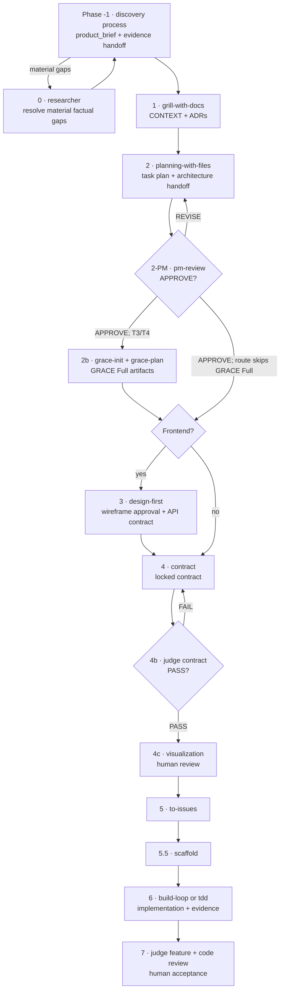

# Pipeline v2 — From Product Brief to Release

This is the human-readable runbook for the setup development pipeline.

Sources of truth:

- `../../pipeline-machine.json` — executable transitions, risk tiers, semantic requirements,
  invalidation rules, and human gates;
- `../agent/PIPELINE-MACHINE.md` — generated phase/requirement view;
- this file — purpose, usage, and operator guidance;
- `ARCHITECTURE-GUIDE.md` — neutral architecture handoff contract;
- `../agent/COMPAT.md` and `../../model-routing.json` — runtime/model compatibility and routing.

When prose and the machine contract disagree, the machine contract wins. Regenerate its human view
with `python3 scripts/render-pipeline-views.py`; verify drift with `--check`.

## Core rules

1. **Choose the risk tier first.** The route must match reversibility, blast radius, uncertainty,
   affected boundaries, and cost of error.
2. **Carry intent in artifacts.** Briefs, plans, contracts, decisions, evidence, and handoffs live on
   disk; chat history is not a pipeline input.
3. **Keep evidence status intact.** A planning or approval decision cannot turn an assumption into a
   validated fact.
4. **Use semantic gates.** File presence is insufficient: verdicts, hashes, invalidation state,
   human signatures, and required models are checked before transitions.
5. **Separate production and acceptance.** A consequential artifact or implementation is reviewed
   from an independent context; build collegium roles use distinct models where required.
6. **Keep human decisions legible.** Scope and architecture are visualized before tickets; contract
   lock and final acceptance remain explicit human gates.

## Pipeline entry contract

The public pipeline does not require a particular discovery method. Its portable input is:

- `product_brief.md` — outcomes, users, scope, proposal, system context, journeys, constraints, and
  success criteria in plain project language;
- `evidence-handoff.json` — claim status, evidence references, assumptions, falsifiers, open
  questions, validation stage, and `stop | alpha | delivery` decision;
- supporting research or business material, when relevant.

The reusable brief template is `../../templates/project/product_brief.md`. Private or
organization-specific discovery processes may fill it, but their terminology must not leak into
phases 0–7.

Full downstream delivery starts only when the semantic machine requirements are satisfied. An alpha
decision is a valid outcome, but it is not permission to enter a delivery route.

## Risk tiers

| Tier | Typical work | Minimum route |
|---|---|---|
| T0 | mechanical, reversible, one boundary | targeted change, lint/test, review, human acceptance |
| T1 | bounded reproduced bugfix | triage, diagnosis, regression TDD, review, human acceptance |
| T2 | small reversible feature | brief/evidence delta, thin plan/contract, judge, visualization, tests/eval |
| T3 | cross-module, uncertain, or costly feature | plan, PM gate, GRACE Full, contract, visualization, issues, scaffold, collegium |
| T4 | safety/regulatory/irreversible change | T3 plus risk/threat review, staged rollout, rollback, audit evidence |

Record the tier and its rationale in `.pipeline-state.json`. A skipped optional step is a policy
decision, not an undocumented omission. A phase outside the selected machine route cannot be entered
by adding a skip record.

## End-to-end flow



`pipeline-machine.json` defines the exact tier-specific edges and requirements. The diagram explains
the common route; it does not override the machine.

## Phase contracts

| Phase | Purpose | Primary output | Gate or key requirement |
|---|---|---|---|
| -1 | establish a supported product/delivery decision | `product_brief.md`, `evidence-handoff.json` | accountable input/signoff owned by discovery process |
| 0 | close material factual gaps | `docs/research-state.json` and updated brief/evidence | source/evidence status preserved |
| 1 | align terminology and document decisions | `CONTEXT.md`, `docs/adr/*.md` | unresolved conflicts remain explicit |
| 2 | decompose outcome into implementable work | `task_plan.md` (+ JSON mirror) | architecture handoff covers responsibilities, flows, risks, verification |
| 2-PM | verify plan against the brief | `pm-review.json` | semantic verdict `APPROVE` |
| 2b | formalize module graph and verification | GRACE XML artifacts | required for T3/T4 unless machine policy says otherwise |
| 3 | approve frontend behavior before API implementation | wireframe, `api-contract.json`, design artifacts | human wireframe approval |
| 4 | define verifiable done | `contract.json`, attestation | contract complete and hash locked |
| 4b | independently evaluate the contract | `judge-report.json` | verdict `PASS` |
| 4c | make plan/structure legible to the human | Mermaid/Markdown view, `SUPERVISION.md` | `viz_before_tickets` signature |
| 5 | create traceable implementation slices | approved issue set | issues link to plan/contract criteria |
| 5.5 | provide code-native implementation boundaries | scaffolded module skeletons | scaffold readiness and contract preservation |
| 6 | implement and verify | code, tests, traces, `build-evidence.json` | collegium/model and build-evidence requirements |
| 7 | accept the completed outcome | feature judge report, code review, rollout evidence | human acceptance; rollback defined when required |

## Phase -1: discovery handoff

Use any discovery process suitable for the context. Before delivery entry, confirm that:

- the brief uses plain project language and identifies its accountable owner;
- claims are labelled as facts, hypotheses, or supported outcomes with references;
- open questions and falsifiers are retained;
- the `validation_stage` and `decision` agree between the brief and evidence handoff;
- `decision: delivery` is supported by the evidence required for the intended risk tier.

If only an alpha is justified, run the alpha, update evidence, and promote/revise/stop before the full
delivery route.

## Phase 0: research only when needed

Run `/researcher` for factual gaps that can change scope, feasibility, risk, or success criteria.
Do not use research to manufacture certainty around a decision already made. Update the brief and
evidence handoff with findings, limitations, contradictions, and remaining uncertainty.

## Phase 1: domain alignment

`/grill-with-docs` consumes the brief and evidence handoff, aligns project vocabulary, and records
non-obvious decisions in `CONTEXT.md` and ADRs. It must not import private discovery vocabulary into
public project terms.

## Phase 2: planning and architecture handoff

`/planning-with-files` decomposes the approved outcome into bounded work. The plan should trace each
phase or component to a journey step and success criterion.

`ARCHITECTURE-GUIDE.md` defines the transfer contract:

- required inputs and conflict handling;
- responsibilities, boundaries, interfaces, data flow, failure/recovery, and verification;
- tier-specific output depth;
- portable module and ADR formats;
- PM re-entry checklist.

The user chooses the architecture method, tool, model, and working surface. The pipeline reviews the
result, not the private reasoning technique that produced it.

## Phase 2-PM: plan approval

`/pm-review` is the only plan approval gate. It checks:

- plan/architecture traceability to `product_brief.md` §7 journeys;
- coverage of §8 success criteria and out-of-scope boundaries;
- implementation tasks for edge/failure cases;
- explicit rationale for consequential decisions;
- owned work for material risks and assumptions.

Generic `/judge plan` does not exist. `REVISE` returns specific gaps to planning; `APPROVE` unlocks
the next transition permitted by the machine.

## Phase 2b: GRACE Full

For routes that require it, `/grace-init` and `/grace-plan` produce:

- `docs/development-plan.xml` — module responsibilities, dependencies, interfaces, and flows;
- `docs/verification-plan.xml` — checks and critical-flow references;
- `docs/knowledge-graph.xml` — stable identifiers and cross-links;
- ADRs for consequential choices.

GRACE is a transfer format. Product intent links into it through stable actor/journey/criterion/ADR
references; GRACE does not impose a product or architecture methodology.

GRACE Lite code contracts are enforced separately by `scripts/grace-lint.sh` where the selected
workflow requires them.

## Phase 3: frontend design

When `is_frontend: true`:

1. `/design-first` creates a wireframe and stops for human approval.
2. The approved wireframe defines the UI flow and data requirements.
3. `api-contract.json` is derived from those requirements.
4. `/design-rubric` creates or updates the project design contract when required.
5. `/contract` references the approved design/API artifacts.

Backend-only work skips the frontend design phase when the machine route permits it.

## Phases 4–5.5: contract, review, tickets, scaffold

`/contract` translates scope, journeys, integrations, risks, and success criteria into verifiable
requirements. Attest the resulting file; changing it invalidates downstream artifacts.

`/judge contract` runs from an isolated evaluator context. A PASS leads to the human-readable
visualization gate. Only after that approval does `/to-issues` create traceable vertical slices.

For greenfield feature work, `/scaffold` writes code-native boundaries before implementation:
module/function contracts, typed signatures, named blocks, log anchors, mocks, and explicit
unimplemented bodies. The implementer must not silently change those boundaries; requested changes
return to the contract/scaffold owner.

## Phases 6–7: build and acceptance

Use `/build-loop` for a contract-driven autonomous cycle or `/tdd` for human-paced test-first work.
The selected route determines required model roles and evidence. Keep implementation, test ownership,
and acceptance independent where the collegium is required.

Verification is layered:

1. **state validity** — transition inputs, hashes, verdicts, and invalidation state;
2. **trajectory validity** — critical path/trace when the contract requires it;
3. **outcome validity** — user-visible or externally observable result;
4. **non-regression** — targeted and broader automated checks;
5. **production evidence** — rollout, errors, latency, adoption/value, and rollback for relevant work.

Phase 7 completes only after feature evaluation, code review, required rollout evidence, and explicit
human acceptance.

## Short bugfix route

For a bounded reproducible defect:

```text
/triage → /diagnose → /tdd (regression first) → /code-review-expert → human acceptance
```

Use T1 and document why the full feature route is unnecessary. Escalate the tier if diagnosis shows
cross-module, data-migration, safety, or irreversible impact.

## State ledger and semantic preflight

Every project uses `.pipeline-state.json` from `../../templates/project/.pipeline-state.json`.
Before a phase, run:

```bash
bash ~/.claude/scripts/pipeline-preflight.sh <phase> [project_dir]
```

The evaluator checks:

- selected risk tier and phase applicability;
- required models and distinct collegium roles;
- required files and SHA-256 attestations;
- invalidation state;
- semantic JSON pointers and expected verdict/stage values;
- human gate signatures (`by` and `at`).

The running agent must still confirm its actual model: the script validates the declared availability
manifest, not the process identity.

Record append-only harness events with `scripts/pipeline-event.py`. Useful fields include phase
duration, gate wait, rework, cost, disagreement, rollback, escaped defects, and user outcome.

## Invalidation

When an upstream artifact changes, mark every declared downstream consumer invalidated and rerun its
gate. Common examples:

- brief/evidence change → research/context/plan/contract may be stale;
- task plan change → PM review, visualization, issues, scaffold may be stale;
- contract change → judge report, visualization, issues, scaffold, and build evidence are stale;
- code/scaffold boundary change → tests, traces, review, and acceptance evidence may be stale.

Exact invalidation declarations live in `pipeline-machine.json` and the producing skill contracts.

## Human supervision artifacts

`/visualization` creates the human track. Keep it separate from the GRACE agent graph.

- choose the review concern and scale before notation;
- use a stable Markdown/Mermaid filename next to the reviewed state artifact;
- link gate views from `SUPERVISION.md`;
- obtain the required signature before tickets or release.

The plan owner supplies the view; a separate human reviewer approves it.

## Model routing

`model-routing.json` owns capability profiles and collegium role-independence policy only.
Each project's `model-bindings.json` maps those profiles to user-selected runtimes and concrete
model IDs. Neither file owns transition semantics.

```bash
bash scripts/model-check.sh <phase>
```

If the current runtime cannot satisfy the required model/role, stop and switch runtime or update the
explicit project policy. Do not claim that a shell script can detect the model that is generating
the current response.

## New project

```bash
/startup <project-name>
cd ~/<project-name>
```

Then:

1. complete `product_brief.md` and `evidence-handoff.json` using your preferred discovery process;
2. run `/researcher` only for material factual gaps;
3. run `/judge product-brief` and `/grill-with-docs`;
4. select the risk tier and continue through the machine route;
5. use `workctl init <task-id> --goal "..."` if work may cross coding CLIs.

## Common mistakes

| Mistake | Corrective action |
|---|---|
| Skipping the product brief | Complete the neutral template and evidence handoff first |
| Copying discovery jargon into delivery artifacts | Translate it into plain project/domain language |
| Treating an assumption as fact | Preserve status, references, falsifier, and open questions |
| Choosing architecture by a prescribed public recipe | Use any suitable method; satisfy the architecture handoff contract |
| Consequential decision without rationale | Record decision, consequences, trade-offs, and real alternatives in an ADR |
| PM review without journey/criteria traceability | Return to the plan; do not approve orphan work or promises |
| Building before contract/visual approval | Run the semantic gates in order |
| Reviewer and implementer are the same required collegium role | Switch model/context as required by routing |
| Editing an attested input without invalidation | Update the ledger and rerun downstream gates |
| Maintaining multiple continuation ledgers | Use one named workctl task; keep `CONTINUITY.md` fallback-only |

The objective is a visible, evidence-aware chain from product intent to accepted behavior. Tools and
methods may vary; transition semantics and handoff accountability remain explicit.
