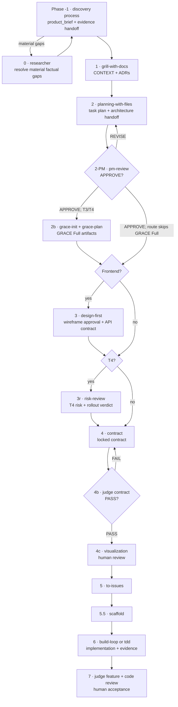

# Pipeline v2 — From Product Brief to Release

This is the human-readable runbook for the setup development pipeline.

Sources of truth:

- `../../pipeline-machine.json` — executable transitions, risk tiers, semantic requirements,
  invalidation rules, and human gates;
- `../agent/PIPELINE-MACHINE.md` — generated phase/requirement view;
- this file — purpose, usage, and operator guidance;
- `ARCHITECTURE-GUIDE.md` — neutral architecture handoff contract;
- `../agent/COMPAT.md` and `../../model-routing.json` — runtime/model compatibility and routing.

When prose and the machine contract disagree, the machine contract wins. Regenerate its human view
with `python3 scripts/render-pipeline-views.py`; verify drift with `--check`.

## Human operator path

Use this section in order. You may enter from Claude Code, Codex, OpenCode, or the terminal/API
fallback. The pipeline names portable skills; translate a skill name using the one runtime-syntax
table in [`SETUP.md`](SETUP.md). Shell commands below are identical in every CLI terminal.

### 1. Verify installation, then bootstrap one project

Do not repeat install commands here; `SETUP.md` owns them. From the project directory:

- **new project:** invoke the `startup` skill with a 1–64 character lowercase slug containing only
  `a-z`, `0-9`, and `-`. Its other inputs are: non-empty free-text display name; GitHub remote
  `yes|no` (default `no`); and, only for `yes`, visibility `private|public` plus an owner discovered
  with `gh api user --jq .login` or `gh api user/orgs --jq '.[].login'`;
- **existing repository:** run `setup-pipeline bootstrap`. It copies missing templates and creates
  `AGENTS.md → CLAUDE.md` only when absent; it never overwrites an existing file. Then run
  `setup-pipeline migrate`: it is a no-op for a current ledger and otherwise writes a timestamped
  `.pipeline-state.json.bak-*` before upgrading version-2 shape. Older semantic versions stop for
  manual review rather than being guessed.

Then run:

```bash
setup-pipeline status
setup-pipeline values
```

`values` is the authoritative discovery command for phase IDs, tier criteria, human gate names,
artifact statuses, capability profiles, runtimes, evidence enums, and schema paths. Use the adjacent
schema when a field is not enumerated inline.

If work may cross CLIs, optionally create durable task identity now:

```bash
workctl init my-task --goal "One concrete delivery outcome"
```

`my-task` follows the workctl ID rule: 1–64 letters, digits, `.`, `_`, or `-`. Allowed launch
runtimes are `claude|codex|opencode`. Workctl is optional and never replaces pipeline phases.

### 2. Complete discovery before selecting the delivery route

The copied ledger starts at Phase `-1` with `risk_tier: null`; this is intentional. No project model
binding is required for Phase -1, so any supported CLI and suitable discovery process may begin:

```bash
setup-pipeline set-phase -1
setup-preflight -1 .
```

Produce or update `product_brief.md` and `evidence-handoff.json`. The key allowed values are:

- `validation_stage`: `discovery|alpha|live`;
- `decision`: `stop|alpha|delivery`;
- brief `status`: `draft|reviewed|pipeline-ready`.

All evidence/spec-gap enums are printed by `setup-pipeline values` and defined in
`evidence-handoff.schema.json`. Before any research or delivery phase, register the exact current
bytes:

```bash
setup-pipeline attest product_brief.md evidence-handoff.json --status ready
```

Branch on `decision`:

- `stop` — stop the delivery route; preserve the evidence and reason;
- `alpha` — run the named experiment and update evidence; do not enter Phase 1;
- `delivery` — continue only when `validation_stage` is `alpha` or `live` and blocking specification
  gaps are resolved, accepted by an accountable owner, or explicitly out of scope.

Before any conditional phase, classify both route facts from the approved brief/evidence. Each value
is exactly `true|false`:

```bash
setup-pipeline set-condition research_required true
setup-pipeline set-condition frontend false
```

When material factual gaps remain, Phase 0 may run before final tier selection. Enable only its
required profiles in `model-bindings.json`, then:

```bash
setup-pipeline set-phase 0
setup-preflight 0 .
```

Invoke `researcher`, update the brief/evidence, then attest `docs/research-state.json` and the changed
brief/evidence. Phase 0 accepts evidence decisions `alpha|delivery`; research is allowed to inform
the delivery decision rather than assume it.

### 3. Confirm conditional branches, select tier, and bind models

Confirm the recorded decisions before selecting the tier:

```bash
setup-pipeline status
```

`research_required=true` requires Phase 0 and its attested `docs/research-state.json` before
Phase 1. `frontend=true` requires Phase 3 and its attested `design-contract.json` and
`api-contract.json` before Phase 4. This replaces informal “skip” notes: an optional phase runs
exactly when its recorded condition is true.

After discovery/research, choose exactly one tier from `T0|T1|T2|T3|T4` using the criteria printed
by `setup-pipeline values` and summarized under “Risk tiers” below:

```bash
setup-pipeline set-tier T2 --reason "Small reversible feature across two boundaries"
setup-pipeline status
```

`--reason` is accountable free text: name the evidence behind reversibility, blast radius,
uncertainty, boundary count, and cost of error. `status` prints the required ordered route.
Changing an already classified tier or condition invalidates downstream attestations and clears
human gates; re-run the newly printed route rather than reusing evidence from the old policy.

Edit `model-bindings.json` only for profiles used by that route. Binding keys are the seven profiles
printed by `values`; `runtime` is
`claude|codex|opencode|api|manual|self-hosted|custom:<lowercase-slug>`; `enabled` is JSON
`true|false`; `model_id` is the exact no-whitespace identifier listed by the selected runtime or
provider (use the “Find an exact model ID” table in `SETUP.md`). The authoritative shape is
`model-bindings.schema.json`; examples and independence rules are in `../agent/COMPAT.md`.

### 4. Run every selected phase with one loop

Continue through the phases printed by `setup-pipeline status` after the discovery/research work
already completed above. The route display is canonical order, not a claim that earlier phases are
unfinished; do not repeat a phase unless its inputs changed or an invalidation requires it. For each
phase you now enter:

```bash
setup-pipeline set-phase PHASE
setup-preflight PHASE .
# invoke the skill named in the Phase execution table
# review its stable output and resolve any REVISE/FAIL/STOP branch
setup-pipeline attest OUTPUT... --status ready
setup-pipeline status
```

Replace `PHASE` only with a value printed by `setup-pipeline values`. Replace `OUTPUT` with the stable
path in the execution table. `--status` accepts `draft|ready|approved|complete`; required inputs may
not remain `draft`. `setup-preflight` already resolves model bindings, so `setup-model-check` is an
optional focused diagnostic, not another mandatory gate. The running agent must still confirm that
its actual runtime/model matches the resolved binding.

The canonical routes are:

| Tier | Ordered work after discovery |
|---|---|
| T0 | targeted deterministic change → `build-evidence.json` → Phase 7 review/completion |
| T1 | `triage` → `diagnose` → `tdd` regression → `build-evidence.json` → Phase 7 review/completion |
| T2 | optional 0 → 1 → 2 → optional 3 → 4 → 4b → 4c → 5 → 6 → 7 |
| T3 | optional 0 → 1 → 2 → 2-PM → 2b → optional 3 → 4 → 4b → 4c → 5 → 5.5 → 6 → 7 |
| T4 | optional 0 → 1 → 2 → 2-PM → 2b → optional 3 → 3r → 4 → 4b → 4c → 5 → 5.5 → 6 → 7 |

“Optional” means its stated condition is false; required phases and gates cannot be waived by a
skip note. A conditional phase that runs uses the same set-phase/preflight/attest loop.

### 5. Record the three human decisions at the correct time

Allowed gate names are exactly `contract_locked`, `viz_before_tickets`, and `human_acceptance`.
`--by` is a free-text attributable person/account identity.

1. After contract judge `PASS`, the human reviews the contract and signs:

   ```bash
   setup-pipeline sign contract_locked --by "name-or-account"
   ```

2. After Phase 4c, the human reviews the supervision view and signs before tickets:

   ```bash
   setup-pipeline attest SUPERVISION.md --status approved
   setup-pipeline sign viz_before_tickets --by "name-or-account"
   ```

3. Phase 7 begins **without** human acceptance. Run its entry preflight, then produce and attest
   `code-review.md` with `**Overall assessment**: APPROVE`; T2–T4 also produce and attest
   `feature-judge-report.json` with verdict `PASS`.
   Only after reviewing those outputs does the human sign and run the terminal completion check:

   ```bash
   setup-pipeline attest code-review.md --status approved
   # T2–T4 only:
   setup-pipeline attest feature-judge-report.json --status approved
   setup-pipeline sign human_acceptance --by "name-or-account"
   setup-preflight 7 . --completion
   ```

If code review requests changes or feature judge returns `CONDITIONAL|FAIL`, return to Phase 6,
update `build-evidence.json`, re-attest it, and repeat Phase 7. Never sign acceptance first.

## Core rules

1. **Classify the delivery route after discovery.** Discovery may begin with an unclassified
   project. Before entering the delivery route, choose a tier from evidenced reversibility, blast
   radius, uncertainty, affected boundaries, and cost of error.
2. **Carry intent in artifacts.** Briefs, plans, contracts, decisions, evidence, and handoffs live on
   disk; chat history is not a pipeline input.
3. **Keep evidence status intact.** A planning or approval decision cannot turn an assumption into a
   validated fact.
4. **Use semantic gates.** File presence is insufficient: verdicts, hashes, invalidation state,
   human signatures, and required models are checked before transitions.
5. **Separate production and acceptance.** A consequential artifact or implementation is reviewed
   from an independent context; build collegium roles use distinct models where required.
6. **Keep human decisions legible.** Scope and architecture are visualized before tickets; contract
   lock and final acceptance remain explicit human gates.
7. **Ask at the knowledge boundary.** Read code and approved artifacts first. Ask only when the next
   transition depends on a decision owned by that person. Give a recommendation and consequences;
   allow `unknown`/`deferred` when discovery or architecture has not produced the answer. Technical
   surfaces are proposed and reviewed by technical roles, not invented by the product owner.
8. **Close material specification gaps explicitly.** `evidence-handoff.json.spec_gaps[]` records the
   ambiguity or missing behavior, impact, owner, materiality, disposition, and resolution evidence.
   Planning and contract preflight halt on an open blocking gap. A model may propose answers or a
   semantic prototype; only the accountable owner may accept risk or move behavior out of scope.

## Pipeline entry contract

The public pipeline does not require a particular discovery method. Its portable input is:

- `product_brief.md` — outcomes, users, scope, proposal, system context, journeys, constraints, and
  success criteria in plain project language;
- `evidence-handoff.json` — claim status, evidence references, assumptions, falsifiers, open
  questions, validation stage, and `stop | alpha | delivery` decision;
- supporting research or business material, when relevant.

The reusable brief template is `../../templates/project/product_brief.md`. Private or
organization-specific discovery processes may fill it, but their terminology must not leak into
phases 0–7.

If a discovery process creates a public `business_model.md`, retain it as supporting business
context for `grill-with-docs` and architecture. It is optional to this neutral pipeline contract;
the mandatory, machine-gated entry remains the brief and evidence handoff.

Full downstream delivery starts only when the semantic machine requirements are satisfied. An alpha
decision is a valid outcome, but it is not permission to enter a delivery route.

## File ownership

| File or state | Owner | How it changes |
|---|---|---|
| `product_brief.md`, `evidence-handoff.json`, `model-bindings.json` | human/project owner | Edit deliberately; validate against the adjacent schema where provided. |
| `.pipeline-state.json` | `setup-pipeline` | Use `bootstrap`/`migrate`/`init`, `set-condition`, `set-tier`, `set-phase`, `attest`, `sign`, `status`, and `values`; do not hand-edit hashes or signatures. Its adjacent `pipeline-state.schema.json` defines the ledger shape. |
| phase artifacts such as plans, contracts, reviews, design and build evidence | producing skill | Run the phase, review its result, then attest the exact files. |
| `pipeline-machine.json`, `model-routing.json`, their schemas and generated machine view | setup maintainer | Change only as a versioned setup-contract update; never edit a project copy to bypass a gate. |

`CONTINUITY.md` is fallback-only. A workctl-managed task instead owns its continuity under
`.workctl/tasks/<task-id>/`; it does not own phase or gate truth.

## Risk tiers

| Tier | Typical work | Minimum route |
|---|---|---|
| T0 | mechanical, reversible, one boundary | targeted change, lint/test, review, human acceptance |
| T1 | bounded reproduced bugfix | triage, diagnosis, regression TDD, review, human acceptance |
| T2 | small reversible feature | brief/evidence delta, thin plan/contract, judge, visualization, tests/eval |
| T3 | cross-module, uncertain, or costly feature | plan, PM gate, GRACE Full, contract, visualization, issues, scaffold, collegium |
| T4 | safety/regulatory/irreversible change | T3 plus risk/threat review, staged rollout, rollback, audit evidence |

`researcher` (Phase 0) is conditional for T2–T4: set `research_required=true` only when such gaps
remain. `design-first` (Phase 3) is conditional for T2–T4: set `frontend=true` only when the change
includes frontend behavior. The ledger values are the skip/run decision; free-text skip notes have
no authority.

Record both conditions, then the tier and rationale, with `setup-pipeline`. Omit a conditional phase
only when its declared condition is false. Required phases and gates have no skip mechanism.

## End-to-end flow



`pipeline-machine.json` defines the exact tier-specific edges and requirements. The diagram explains
the common route; it does not override the machine.

## Phase contracts

| Phase | Purpose | Primary output | Gate or key requirement |
|---|---|---|---|
| -1 | establish a supported product/delivery decision | `product_brief.md`, `evidence-handoff.json` | accountable input/signoff owned by discovery process |
| 0 | close material factual gaps | `docs/research-state.json` and updated brief/evidence | source/evidence status preserved |
| 1 | align terminology and document decisions | `CONTEXT.md`, `docs/adr/*.md` | unresolved conflicts remain explicit |
| 2 | decompose outcome into implementable work | `task_plan.md` (+ JSON mirror) | architecture handoff covers responsibilities, flows, risks, verification |
| 2-PM | verify plan against the brief | `pm-review.json` | semantic verdict `APPROVE` |
| 2b | formalize module graph and verification | GRACE XML artifacts | required for T3/T4 unless machine policy says otherwise |
| 3 | approve frontend behavior before API implementation | wireframe, `api-contract.json`, design artifacts | human wireframe approval |
| 3r | independently resolve T4 delivery risks before contract | `risk-review.json`, `rollout-plan.json` | verdict `PASS`; accountable residual-risk acceptance |
| 4 | define verifiable done | `contract.json`, attestation | contract complete and hash locked |
| 4b | independently evaluate the contract | `judge-report.json` | verdict `PASS` |
| 4c | make plan/structure legible to the human | Mermaid/Markdown view, `SUPERVISION.md` | `viz_before_tickets` signature |
| 5 | create traceable implementation slices | approved issue set | issues link to plan/contract criteria |
| 5.5 | provide code-native implementation boundaries | scaffolded module skeletons | scaffold readiness and contract preservation |
| 6 | implement and verify | code, tests, traces, `build-evidence.json` | collegium/model and build-evidence requirements |
| 7 | review and accept the completed outcome | `feature-judge-report.json` for T2–T4, `code-review.md`, rollout evidence | entry check first; human acceptance and `--completion` check last |

## Phase -1: discovery handoff

Use any discovery process suitable for the context. Before delivery entry, confirm that:

- the brief uses plain project language and identifies its accountable owner;
- claims are labelled as facts, hypotheses, or supported outcomes with references;
- open questions and falsifiers are retained;
- the `validation_stage` and `decision` agree between the brief and evidence handoff;
- `decision: delivery` is supported by the evidence required for the intended risk tier.

If only an alpha is justified, run the alpha, update evidence, and promote/revise/stop before the full
delivery route.

## Phase 0: research only when needed

Run `researcher` for factual gaps that can change scope, feasibility, risk, or success criteria.
Do not use research to manufacture certainty around a decision already made. Update the brief and
evidence handoff with findings, limitations, contradictions, and remaining uncertainty. Attest
`docs/research-state.json` plus the changed brief/evidence before Phase 1.

## Phase 1: domain alignment

`grill-with-docs` consumes the brief and evidence handoff, aligns project vocabulary, and records
non-obvious decisions in `CONTEXT.md` and ADRs. It must not import private discovery vocabulary into
public project terms.

## Phase 2: planning and architecture handoff

`planning-with-files` decomposes the approved outcome into bounded work. The plan should trace each
phase or component to a journey step and success criterion.

`ARCHITECTURE-GUIDE.md` defines the transfer contract:

- required inputs and conflict handling;
- responsibilities, boundaries, interfaces, data flow, failure/recovery, and verification;
- tier-specific output depth;
- portable module and ADR formats;
- PM re-entry checklist.

For multi-actor or branching behavior, use the readable behavior stack defined there: end-to-end
activity/swimlane flow → textual use cases → local sequence diagrams only for message-order
hotspots → executable `contract.json` paths. Large all-purpose diagrams are not specifications.

The user chooses the architecture method, tool, model, and working surface. The pipeline reviews the
result, not the private reasoning technique that produced it.

## Phase 2-PM: plan approval

`pm-review` is the only plan approval gate. It checks:

- plan/architecture traceability to `product_brief.md` §7 journeys;
- coverage of §8 success criteria and out-of-scope boundaries;
- implementation tasks for edge/failure cases;
- explicit rationale for consequential decisions;
- owned work for material risks and assumptions.
- no unresolved blocking specification gap and traceable behavior projections at the appropriate
  level of detail.

Generic `judge plan` does not exist. `REVISE` returns specific gaps to planning; `APPROVE` unlocks
the next transition permitted by the machine.

## Phase 2b: GRACE Full

For routes that require it, `grace-init` and `grace-plan` produce:

- `docs/development-plan.xml` — module responsibilities, dependencies, interfaces, and flows;
- `docs/verification-plan.xml` — checks and critical-flow references;
- `docs/knowledge-graph.xml` — stable identifiers and cross-links;
- ADRs for consequential choices.

GRACE is a transfer format. Product intent links into it through stable actor/journey/criterion/ADR
references; GRACE does not impose a product or architecture methodology.

GRACE Lite code contracts are enforced separately by `scripts/grace-lint.sh` where the selected
workflow requires them.

## Phase 3: frontend design

When `is_frontend: true`:

1. `design-rubric` creates the one-time project design contract when it is missing or stale. On a
   greenfield project it may declare initial tokens; existing CSS tokens are evidence, not a prerequisite.
2. `design-first` creates a wireframe and stops for product-owner approval of flow, screens, and interactions.
3. A technical reviewer derives and checks data requirements and `api-contract.json` from the approved experience.
4. `contract` references the approved design/API artifacts.

Backend-only work skips the frontend design phase when the machine route permits it.
For frontend work, attest `design-contract.json`, `api-contract.json`, and the approved wireframe
path printed by the skill; Phase 4 machine-checks both stable contracts.

## Phase 3r: T4 risk review

For T4, invoke `risk-review` in an independent context after the approved plan/GRACE artifacts and
any frontend design. It writes stable root `risk-review.json` and `rollout-plan.json` using their
project schemas. Verdict values are `PASS|REVISE|STOP`; risk categories, impact, likelihood,
residual-risk, and status enums are in `risk-review.schema.json`. Only `PASS` enters Phase 4.

## Phases 4–5.5: contract, review, tickets, scaffold

`contract` translates scope, journeys, integrations, risks, and success criteria into verifiable
requirements. Attest the resulting file; changing it invalidates downstream artifacts.

`judge contract` runs from an isolated evaluator context. A PASS leads to the human-readable
visualization gate. Only after that approval does `to-issues` create traceable vertical slices.

For greenfield feature work, `scaffold` writes code-native boundaries before implementation:
module/function contracts, typed signatures, named blocks, log anchors, mocks, and explicit
unimplemented bodies. The implementer must not silently change those boundaries; requested changes
return to the contract/scaffold owner.

## Phases 6–7: build and acceptance

Use `build-loop` for a contract-driven autonomous cycle or `tdd` for human-paced test-first work.
The selected route determines required model roles and evidence. Keep implementation, test ownership,
and acceptance independent where the collegium is required.

Verification is layered:

1. **state validity** — transition inputs, hashes, verdicts, and invalidation state;
2. **trajectory validity** — critical path/trace when the contract requires it;
3. **outcome validity** — user-visible or externally observable result;
4. **non-regression** — targeted and broader automated checks;
5. **production evidence** — rollout, errors, latency, adoption/value, and rollback for relevant work.

Phase 7 completes only after feature evaluation, code review, required rollout evidence, and explicit
human acceptance.

## Short bugfix route

For T0, the current implementer performs the deterministic edit and its targeted check, then updates
the copied `build-evidence.json` with `route: targeted`, at least one actual `checks[]` entry with
`status: pass`, and `status: complete`. Attest it before entering Phase 7; the adjacent schema owns
all other allowed fields.

For a bounded reproducible defect:

```text
triage → diagnose → tdd (regression first) → code-review-expert → human acceptance
```

Use T1 and document why the full feature route is unnecessary. Escalate the tier if diagnosis shows
cross-module, data-migration, safety, or irreversible impact.

## State ledger and semantic preflight

Every project uses `.pipeline-state.json` from `../../templates/project/.pipeline-state.json`.
Use `setup-pipeline` to update it; do not hand-calculate or paste hashes. Run
`setup-pipeline values` whenever an allowed value or schema owner is unclear:

```bash
setup-pipeline set-phase 4b
setup-pipeline attest contract.json
setup-pipeline set-condition frontend false
setup-pipeline sign contract_locked --by "name-or-account"
setup-pipeline status
```

Before a phase, run:

```bash
setup-preflight PHASE [project_dir]
```

The evaluator checks:

- selected risk tier and phase applicability;
- required models and distinct collegium roles;
- required files and SHA-256 attestations;
- invalidation state;
- semantic JSON pointers and expected verdict/stage values;
- human gate signatures (`by` and `at`).

The running agent must still confirm its actual model: the script validates the declared availability
manifest, not the process identity.

Record append-only harness events from the setup checkout with
`python3 ~/setup/scripts/pipeline-event.py`. Useful fields include phase
duration, gate wait, rework, cost, disagreement, rollback, escaped defects, and user outcome.

## Run or resume a phase

From the project root, use the same loop whether beginning or resuming work:

```bash
setup-pipeline status
setup-pipeline set-phase 2
setup-model-check 2 .
setup-preflight 2 .
```

If preflight passes, invoke the phase skill in the current runtime. Register every required artifact
after the skill produces it; this records its exact bytes and invalidates registered downstream
artifacts if an upstream hash changed.

```bash
setup-pipeline attest task_plan.md
```

Review before recording a human gate:

```bash
setup-pipeline sign viz_before_tickets --by "name-or-account"
```

| Phase | Invoke | Register or sign after success |
|---|---|---|
| -1 | selected discovery process; private installs may use `methodology` | `product_brief.md`, `evidence-handoff.json`, and `business_model.md` if that process produced it |
| 0 | `researcher` only when material factual gaps remain | research state plus changed brief/evidence |
| 1 | `grill-with-docs` | attest stable `CONTEXT.md` plus relevant ADRs |
| 2 | `planning-with-files` | `task_plan.md` and its JSON mirror |
| 2-PM | `pm-review` in an independent context | `pm-review.json` |
| 2b | `grace-init`, then `grace-plan` | required GRACE XML files |
| 3 | `design-rubric` when needed, then `design-first` for frontend work | `design-contract.json`, `api-contract.json`, and the approved `docs/wireframe-<feature>.md` path returned by the skill |
| 3r | `risk-review` for T4 | `risk-review.json`, `rollout-plan.json`; continue only on `PASS` |
| 4 | `contract` | `contract.json` (the skill also creates its lock file) |
| 4b | `judge contract` in an independent context | `judge-report.json` |
| 4c | `visualization` | `SUPERVISION.md` and the review view |
| 5 | `to-issues` after `viz_before_tickets` is signed | `issues-manifest.json` with status `approved` |
| 5.5 | `scaffold` | `scaffold-manifest.json` with status `ready` |
| 6 | `build-loop` or `tdd` after `contract_locked` is signed | `build-evidence.json` with status `complete` |
| 7 | T0/T1: `code-review-expert`; T2–T4: `judge feature`, then `code-review-expert` | stable final reports, then `human_acceptance`, then `setup-preflight 7 . --completion` |

For a workctl-managed task, first run `workctl status <task-id>` and then use the ledger status and
preflight. Never infer the current phase from chat history or file timestamps.

## Invalidation

When an upstream artifact changes, mark every declared downstream consumer invalidated and rerun its
gate. Common examples:

- brief/evidence change → research/context/plan/contract may be stale;
- task plan change → PM review, visualization, issues, scaffold may be stale;
- contract change → judge report, visualization, issues, scaffold, and build evidence are stale;
- code/scaffold boundary change → tests, traces, review, and acceptance evidence may be stale.

Exact invalidation declarations live in `pipeline-machine.json` and the producing skill contracts.
When a changed source invalidates the evidence behind a human gate, `setup-pipeline attest` also
clears that signature. Review the refreshed artifacts and sign again; an earlier approval cannot be
carried across changed bytes.

## Human supervision artifacts

`visualization` creates the human track. Keep it separate from the GRACE agent graph.

- choose the review concern and scale before notation;
- use a stable Markdown/Mermaid filename next to the reviewed state artifact;
- link gate views from `SUPERVISION.md`;
- obtain the required signature before tickets or release.

The plan owner supplies the view; a separate human reviewer approves it.

## Model routing

`model-routing.json` owns capability profiles and collegium role-independence policy only.
Each project's `model-bindings.json` maps those profiles to user-selected runtimes and concrete
model IDs. Neither file owns transition semantics.

Treat the phase profile as a minimum, then route the task by recorded signals:
`requirement_uncertainty`, `knowledge_rarity`, `interaction_density`, `fidelity_need`,
`reversibility`, and `cost_of_error`. High uncertainty or error cost strengthens synthesis and
independent acceptance; high rarity or fidelity can justify a stronger first implementation pass.
Bounded, reversible, explicit work with fast test feedback may use a cheaper compatible binding.
Do not select by the prestige of a role title, and never let task signals weaken a phase minimum or
role-independence rule.

```bash
setup-model-check <phase> [project_dir]
```

If the current runtime cannot satisfy the required model/role, stop and switch runtime or update the
explicit project policy. Do not claim that a shell script can detect the model that is generating
the current response.

## Common mistakes

| Mistake | Corrective action |
|---|---|
| Skipping the product brief | Complete the neutral template and evidence handoff first |
| Copying discovery jargon into delivery artifacts | Translate it into plain project/domain language |
| Treating an assumption as fact | Preserve status, references, falsifier, and open questions |
| Letting a model plausibly fill a requirement gap | Record a typed specification gap; answer it, run a semantic prototype, accept the risk, or move it out of scope with accountable ownership |
| One large sequence diagram for a complete journey | Use activity/swimlane overview, textual use cases, and local sequence diagrams only where message order is the review concern |
| Choosing architecture by a prescribed public recipe | Use any suitable method; satisfy the architecture handoff contract |
| Consequential decision without rationale | Record decision, consequences, trade-offs, and real alternatives in an ADR |
| PM review without journey/criteria traceability | Return to the plan; do not approve orphan work or promises |
| Building before contract/visual approval | Run the semantic gates in order |
| Reviewer and implementer are the same required collegium role | Switch model/context as required by routing |
| Editing an attested input without invalidation | Update the ledger and rerun downstream gates |
| Maintaining multiple continuation ledgers | Use one named workctl task; keep `CONTINUITY.md` fallback-only |

The objective is a visible, evidence-aware chain from product intent to accepted behavior. Tools and
methods may vary; transition semantics and handoff accountability remain explicit.
