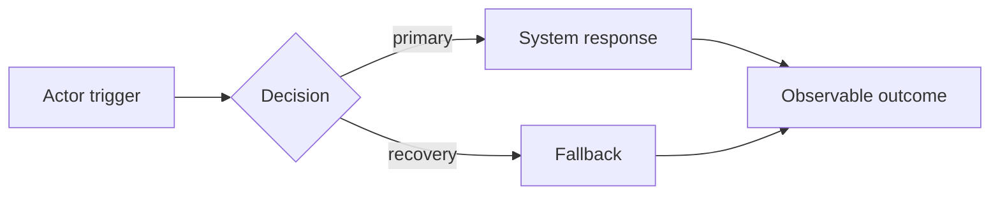

# Behavior Flow: [FLOW-ID] [Outcome]

## Review question

What happens from the initiating trigger to the observable outcome, including branches, recovery,
and handoffs between actors? Keep this view at one altitude.

## References

- Journey: `product_brief.md#7-user-journey`
- Criteria: `[criterion-id]`
- Use cases: `UC-...`

## Activity view

Use UML activity notation when the project toolchain supports it. Mermaid users may use a flowchart
with clearly labelled actor swimlanes. This overview must not contain payload schemas or component
implementation details.

## Open specification gaps

| Gap ID | Ambiguity or missing behavior | Owner | Disposition |
|---|---|---|---|
| SG-... | ... | ... | answer / prototype / accept_risk / out_of_scope |

## Readability check

- One concern and one altitude.
- Recommended: no more than 12–15 meaningful nodes.
- More than 20 nodes or nesting deeper than 3 requires a split or a recorded justification.
